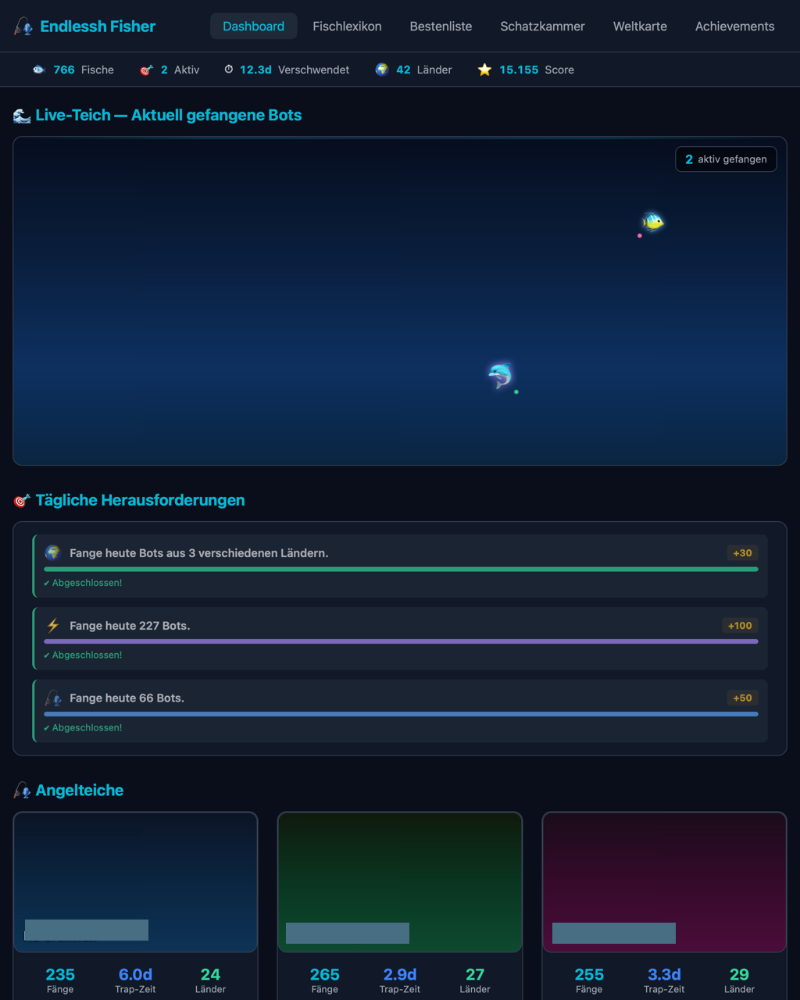

# Endlessh Fisher

Turn your SSH tarpit into a fishing game. Endlessh Fisher connects to your
[endlessh-go](https://github.com/shizunge/endlessh-go) honeypot via InfluxDB
and transforms trapped SSH bots into collectible fish — complete with species,
rarities, achievements, and a live aquarium dashboard.



> **Note:** Endlessh Fisher is a gamification and visualization layer — it does
> not provide any security functionality on its own. All the actual trapping is
> done by [endlessh-go](https://github.com/shizunge/endlessh-go). This project
> simply reads that data and turns it into a fishing game for your entertainment.

## Features

- **Live Aquarium Dashboard** — Watch trapped bots swim as fish in real-time,
  with species determined by how long they stay trapped (30 seconds = Sardine,
  14 days = Leviathan)
- **12 Fish Species** — From common Plankton to mythic Leviathan, each with
  unique rarity tiers and point values
- **Multi-Server Support** — Monitor multiple endlessh instances as separate
  "fishing ponds" with individual themes (ocean, lake, reef)
- **Achievement System** — 50+ achievements across 8 categories with bronze
  to diamond rarities and secret unlockables
- **Daily Challenges** — Three new challenges every day (easy, medium, hard)
  to keep the game engaging
- **Treasure Collection** — Collectible treasures spawn in your pond, each
  containing real-world security tips
- **IP Intelligence** — On-click IP analysis via Shodan InternetDB and
  AbuseIPDB (optional) showing open ports, abuse scores, and vulnerabilities
- **World Map** — See which countries your trapped bots come from
- **Leaderboards** — Track longest traps, highest scores, and records per species
- **Fish Encyclopedia** — Pokédex-style collection tracker for all species
- **Bilingual** — Full German and English support via `GAME_LANGUAGE` setting
- **Privacy-First** — All IPs are SHA256-hashed by default, no external
  resources loaded (GDPR-friendly), optional real IP display
- **REST API** — Full read-only API for all game data

## Prerequisites

- **[endlessh-go](https://github.com/shizunge/endlessh-go)** running on one
  or more servers
- **[InfluxDB 2.x](https://docs.influxdata.com/influxdb/v2/)** receiving
  metrics from endlessh-go
- **Docker** and **Docker Compose**

## Quick Start

```bash
# Clone the repository
git clone https://github.com/DarkWolfCave/endlessh-fisher.git
cd endlessh-fisher

# Configure environment
cp .env.example .env
# Edit .env with your InfluxDB connection details and secrets

# Configure your endlessh servers
cp servers.toml.example servers.toml
# Edit servers.toml — set host_identifier to match your InfluxDB host tags

# Start the stack
docker compose up -d

# Initialize the database and seed game data
docker compose exec backend python manage.py migrate
docker compose exec backend python manage.py seed_game_data
docker compose exec backend python manage.py setup_servers

# Open http://localhost:8000
```

## Configuration

### Environment Variables (`.env`)

| Variable | Required | Default | Description |
|----------|----------|---------|-------------|
| `SECRET_KEY` | Yes | — | Django secret key |
| `ALLOWED_HOSTS` | Yes | — | Comma-separated hostnames |
| `ADMIN_URL` | Yes | — | Secret path for Django admin |
| `POSTGRES_PASSWORD` | Yes | — | PostgreSQL password |
| `REDIS_PASSWORD` | Yes | — | Redis password |
| `INFLUXDB_URL` | Yes | — | InfluxDB URL (e.g. `http://influxdb:8086`) |
| `INFLUXDB_TOKEN` | Yes | — | InfluxDB API token |
| `INFLUXDB_ORG` | Yes | — | InfluxDB organization |
| `INFLUXDB_BUCKET` | Yes | — | InfluxDB bucket with endlessh metrics |
| `SHOW_REAL_IP` | No | `false` | Show real IPs instead of hashes |
| `GAME_LANGUAGE` | No | `de` | UI language: `de` or `en` |
| `ABUSEIPDB_API_KEY` | No | — | AbuseIPDB API key for IP lookups |

### Server Configuration (`servers.toml`)

Each endlessh instance is a "fishing pond":

```toml
[[servers]]
slug = "my-server"
name = "My Main Server"
host_identifier = "my-hostname"  # Must match InfluxDB host tag
description = "Deep waters, heavy traffic."
pond_theme = "ocean"  # ocean, lake, or reef
```

Find your `host_identifier` with:
```
influx query 'from(bucket:"YOUR_BUCKET")
  |> range(start:-1h)
  |> filter(fn:(r) => r._measurement == "endlessh_client_open_count")
  |> keep(columns:["host"])
  |> distinct(column:"host")'
```

## Production Deployment

Two Docker Compose configs are provided:

### Simple (any reverse proxy)

```bash
docker compose -f docker-compose.prod.yml up -d
```

Exposes port 8000. Put Nginx, Caddy, or any reverse proxy in front.

### Traefik with Blue-Green Deployment

```bash
# Uncomment GAME_DOMAIN and CERT_RESOLVER in .env
docker compose -f docker-compose.prod.traefik.yml up -d
```

Requires an external Traefik instance with a `proxy` Docker network.

## How It Works

```
endlessh-go → InfluxDB → [Celery Sync every 5min] → PostgreSQL → Django/HTMX
```

1. **endlessh-go** traps SSH bots and writes metrics to InfluxDB
2. **Celery** syncs bot data from InfluxDB to PostgreSQL every 5 minutes
3. **Django** classifies bots into fish species based on trap duration
4. **HTMX** provides real-time dashboard updates (polling every 15-60s)
5. **Achievements & Challenges** are evaluated automatically every 10 minutes

### Fish Species

| Species | Trap Duration | Rarity |
|---------|--------------|--------|
| Plankton | 0 – 30s | Common |
| Sardine | 30s – 2min | Common |
| Anchovy | 2 – 10min | Common |
| Trout | 10 – 30min | Uncommon |
| Pike | 30min – 1h | Uncommon |
| Salmon | 1 – 4h | Rare |
| Tuna | 4 – 12h | Rare |
| Swordfish | 12h – 1d | Epic |
| Marlin | 1 – 3d | Epic |
| Whale Shark | 3 – 7d | Legendary |
| Kraken | 7 – 14d | Legendary |
| Leviathan | 14d+ | Mythic |

## Tech Stack

- **Backend:** Django 6.0, Django REST Framework, Celery, Redis
- **Frontend:** HTMX, Alpine.js, Tailwind CSS (all self-hosted)
- **Database:** PostgreSQL 18, Redis 8.6
- **Data Source:** InfluxDB 2.x (via influxdb-client)
- **Runtime:** Python 3.14, Gunicorn, Docker

## Management Commands

```bash
# Seed fish species, achievements, treasures, challenges, security tips
docker compose exec backend python manage.py seed_game_data

# Import server config and run initial sync
docker compose exec backend python manage.py setup_servers

# Re-run with custom config path
docker compose exec backend python manage.py setup_servers --config /path/to/servers.toml
```

## API Endpoints

All endpoints are read-only (GET):

| Endpoint | Description |
|----------|-------------|
| `/api/v1/health/` | Health check |
| `/api/v1/dashboard/` | Dashboard stats |
| `/api/v1/catches/` | Caught bots (filterable) |
| `/api/v1/catches/latest/` | Latest catches |
| `/api/v1/servers/` | Server list |
| `/api/v1/species/` | Fish species |
| `/api/v1/stats/daily/` | Daily statistics |
| `/api/v1/stats/countries/` | Country statistics |
| `/api/v1/achievements/` | Achievements with unlock status |

## License

[MIT](LICENSE)

## Author

Created by [DarkWolfCave](https://darkwolfcave.de)
